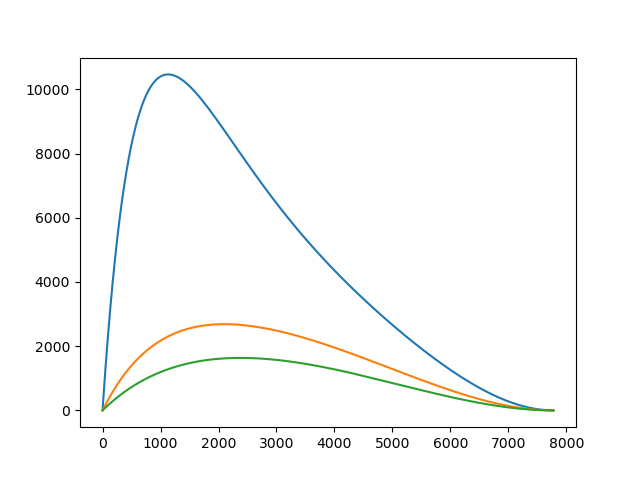

Requirements:  
Ferryboat.py: math, numpy, and matplotlib libraries  
Buffon.cpp:  iostream, random, chrono, and fstream libraries and C++ compiler.

# Problem #1 

## Setup
In the first problem, we are given a 2D Cartesian coordinate system to represent a section of a river. 
We are also given the speed of the water based on the x-coordinate of the location in the river.
Finally, we are told that a ferryboat is attempting to cross from point (a,0) to (0,0) where a = 7777. 
Given three different initial speeds of the boat, 7, 14, and 21, we are told to graph the trajectory the boat would make on its path from east to west.

## Algorithm Description
First we must set up the differential equations for the boat. These are given in the image below:

Then after eliminating the explicit dependence on t in the two DE's we get:

Finally we can implement the Runge-Kutta method, starting *t* from *a* (7777) and with a step size *h* of -.1 all the way to zero. This algorithm is described in the image below.

The algorithm is run iteratively, using the previous iteration's result for *y* for the next *y* and at the same time decreasing the x-value by the step size *h*. For each starting speed, the points are sent to text files.

## Pseudocode

    # h is step_size
    def runge_kutta(x, y, h, vb):
       k1 = f(x, y, vb)
       k2 = f(x + (.5*h), y + (.5 * h * k1), vb)
       k3 = f(x + (.5*h), y + (.5 * h * k2), vb)
       k4 = f(x + h, y + (h * k3), vb)
       return y * (1/6)*h*(k1 + 2k2 + 2k3 + k4)
       
    def f(x, y, vb):
      dx/dy provided in the setup for the problem
    
    def main():
      step_size = -0.1
      x = generate points from 7777 to 0 with step_size
      y = [0]
      vb = [7, 14, 21]
      
      for initial_speed in vb:
          for x_cor in x:
              append to y result from runge_kutta(x, y, h, vb)
          plot the points
          send points to text file
          reset y
          
## Answer
The graph is exactly as the Professor provided in the homework description. The actual points are located in text files that are generated while running the code. The files are labelled based off of the speed of the boat. 

# Problem #2

## Setup

In this problem we have a disk with a diameter of 0.75 units. We are asked, similarly to Buffon's Needle problem, to drop the disc between parallel lines that are separated by 1 unit. We are supposed to do this 1,984,444,444 times and estimate the probability that the disc would cross a line. 

## Algorithm Description

The disc is only 0.75 units long and as a result it is only capable of crossing one line at a time. Therefore, I only generated two possible lines for this disc to cross, since more would be redundant. Also, I did not generate a y-coordinate because the object being dropped is a disc and the lines are to the left and right of it. If a disc doesn't intersect a line (meaning the radius is less than the distance from the center of the circle to the line), then moving the disc up/down the y-axis will not make it intersect and same for the reverse.   
I generated a uniform random variable from 0 to 1 that would represent the center of the circle. The two parallel lines were at 0 and 1. If the number was less than 3/8 or greater than 5/8 (3/8 being the radius of the circle), this would mean the circle had left the boundary and would be marked down as having left. This was done 1,984,444,444 times and for every 10,000,000 drops the drop number is printed to the console to mark progress.

## Pseudocode

    def main():
        counter = 0
        lands = 0
        while counter < 1984444444:
           u1 = uniform number between 0 and 1
           if (u1 < 3.0/8 or u1 > 5.0/8):
           counter++
           
        return lands*100.0/counter
        
## Answer

Unsurprisingly the result is that the disc intersects one of the lines ~75% of the time. 
              

        

