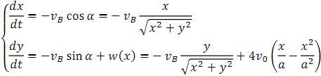
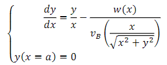
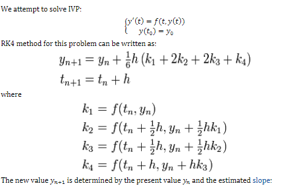

# Problem #1 

## Setup
In the first problem, we are given a 2D Cartesian coordinate system to represent a section of a river. 
We are also given the speed of the water based on the x-coordinate of the location in the river.
Finally, we are told that a ferryboat is attempting to cross from point (a,0) to (0,0) where a = 7777. 
Given three different initial speeds of the boat, 7, 14, and 21, we are told to graph the trajectory the boat would make on its path from east to west.

## Algorithm Description
First we must set up the differential equations for the boat. These are given in the image below:

Then after eliminating the explicit dependence on t in the two DE's we get:

Finally we can implement the Runge-Kutta method, starting *t* from *a* (7777) and with a step size *h* of -.1 all the way to zero. This algorithm is described in the image below.

The algorithm is run iteratively, using the previous iteration's result for *y* for the next *y* and at the same time decreasing the x-value by the step size *h*. 
